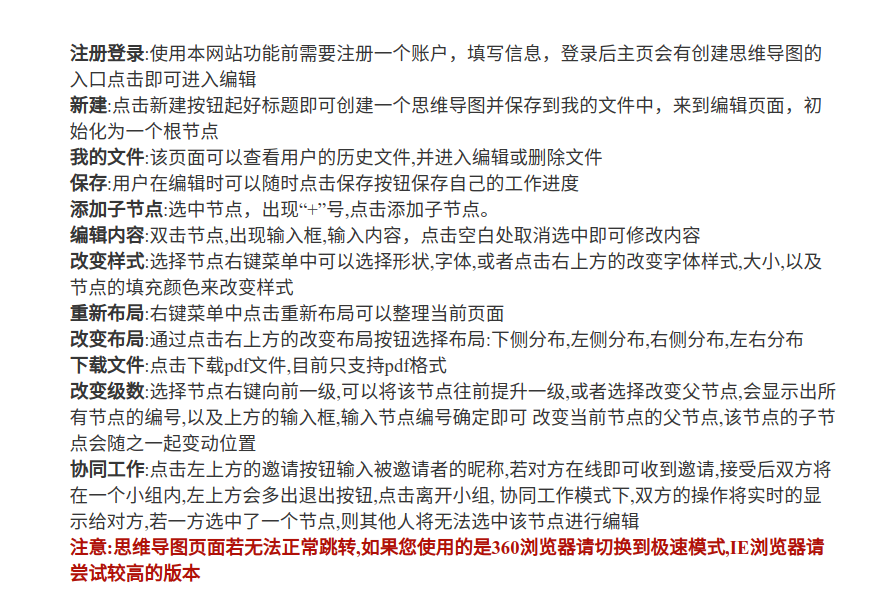
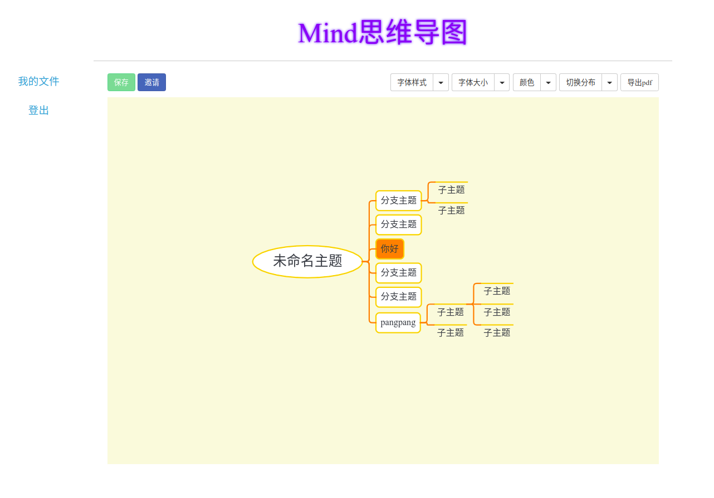

# MindMap
### 项目简介

学校软件工程课程要求，搭建一个可以多人协同工作的思维导图编辑网站，B/S架构，思维导图软件或网站很多，但是本项目在可以编辑思维导图的基础上加入了协同编辑的功能，一个人编辑的结果能够实时的显示给其他人。从而实现了协同编辑的功能。
### 功能简介

##### 编辑界面

### 技术路线

- **后端**:node.js,mongodb,express
- **前台**:ejs,jquery,javascript,Go.js(画图工具)
- **协同编辑**:socket技术，每一个编辑操作实时传递。

